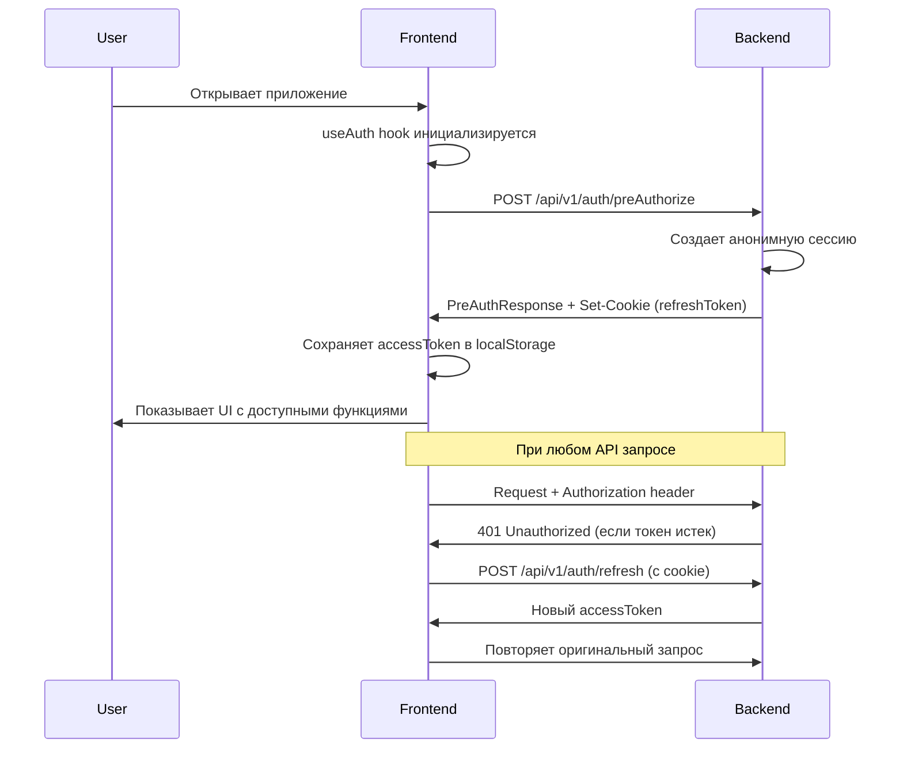

# Руководство по интеграции Backend API

## Обзор интеграции `/preAuthorize`

Эндпоинт `/preAuthorize` используется для создания анонимной пользовательской сессии при первом запуске приложения. Это позволяет пользователям взаимодействовать с приложением без необходимости регистрации.

## Архитектура

### Backend (Spring Boot)

**Контроллер**: `AuthController.java`
- **Путь**: `POST /api/v1/auth/preAuthorize`
- **Ответ**: `PreAuthResponse`
  ```java
  {
    "accessToken": "eyJhbGc...",
    "accessExpiresIn": 3600,  // секунды
    "role": "ROLE_ANONYMOUS",
    "sessionId": "uuid-session-id",
    "steamId": null  // опционально, если пользователь авторизован через Steam
  }
  ```
- **Headers**: Устанавливает `Authorization: Bearer <token>` в ответе
- **Cookies**: Устанавливает HTTP-only cookie с refresh token

### Frontend (React + TypeScript)

#### 1. API Client ([src/services/api.ts](src/services/api.ts))

**Настройка Axios**:
```typescript
const API_BASE_URL = import.meta.env.VITE_API_URL || 'http://localhost:8080/api/v1';

const api = axios.create({
  baseURL: API_BASE_URL,
  timeout: 10000,
  withCredentials: true,  // Важно для cookies!
});
```

**Request Interceptor** - добавляет токен к каждому запросу:
```typescript
api.interceptors.request.use((config) => {
  const token = localStorage.getItem('accessToken');
  if (token) {
    config.headers.Authorization = `Bearer ${token}`;
  }
  return config;
});
```

**Response Interceptor** - обрабатывает 401 и обновляет токен:
```typescript
api.interceptors.response.use(
  (response) => response,
  async (error) => {
    if (error.response?.status === 401 && !originalRequest._retry) {
      // Пытаемся обновить токен через /auth/refresh
      const response = await axios.post(`${API_BASE_URL}/auth/refresh`, {}, {
        withCredentials: true,
      });
      // Сохраняем новый токен и повторяем запрос
      localStorage.setItem('accessToken', response.data.accessToken);
      return api(originalRequest);
    }
    return Promise.reject(error);
  }
);
```

**API функция**:
```typescript
export const authApi = {
  async preAuthorize(): Promise<PreAuthResponse> {
    const response = await api.post<PreAuthResponse>('/auth/preAuthorize');
    return response.data;
  }
};
```

#### 2. React Hook ([src/hooks/useAuth.ts](src/hooks/useAuth.ts))

```typescript
export const useAuth = () => {
  const [authData, setAuthData] = useState<PreAuthResponse | null>(null);
  const [isLoading, setIsLoading] = useState(true);
  const [error, setError] = useState<string | null>(null);

  useEffect(() => {
    const preAuthorize = async () => {
      const response = await authApi.preAuthorize();
      setAuthData(response);

      // Сохраняем токены
      localStorage.setItem('accessToken', response.accessToken);
      localStorage.setItem('sessionId', response.sessionId);
    };

    preAuthorize();
  }, []);

  return { authData, isLoading, error, isAuthenticated: !!authData?.accessToken };
};
```

#### 3. App Component ([src/App.tsx](src/App.tsx))

```typescript
export default function PlayCureApp() {
  const { authData, isLoading, error, isAuthenticated } = useAuth();

  // Показываем загрузку
  if (isLoading) return <LoadingScreen />;

  // Показываем ошибку с кнопкой retry
  if (error) return <ErrorScreen error={error} />;

  // Основной UI
  return <MainApp authData={authData} />;
}
```

## Поток данных



## Тестирование

### 1. Запуск Backend

```bash
cd game-recommender-ai/services/backend
./mvnw spring-boot:run
```

Backend должен быть доступен на `http://localhost:8080`

### 2. Запуск Frontend

```bash
cd game-recommender-ai-ui
npm install
npm run dev
```

Frontend будет доступен на `http://localhost:5173`

### 3. Проверка интеграции

**В браузере**:
1. Откройте DevTools (F12)
2. Перейдите на вкладку Network
3. Обновите страницу
4. Найдите запрос `preAuthorize`:
   - Статус должен быть `200 OK`
   - В Response должен быть JSON с `accessToken`, `sessionId`, и т.д.
   - В Cookies должен появиться `refreshToken` (HTTP-only)

**В Console**:
```javascript
// Проверить наличие токена
localStorage.getItem('accessToken')
// Должен вернуть JWT токен

localStorage.getItem('sessionId')
// Должен вернуть UUID
```

### 4. Тестирование Token Refresh

1. В DevTools -> Application -> Local Storage -> удалите `accessToken`
2. Попробуйте сделать любой API запрос
3. В Network должно появиться:
   - Запрос с 401 ошибкой
   - Запрос `/auth/refresh` с 200 OK
   - Повторный запрос с новым токеном

## Устранение неполадок

### CORS ошибки

Если видите CORS ошибки, проверьте настройки бэкенда:

```java
@Configuration
public class WebConfig {
    @Bean
    public WebMvcConfigurer corsConfigurer() {
        return new WebMvcConfigurer() {
            @Override
            public void addCorsMappings(CorsRegistry registry) {
                registry.addMapping("/api/**")
                    .allowedOrigins("http://localhost:5173")
                    .allowedMethods("GET", "POST", "PUT", "DELETE", "OPTIONS")
                    .allowCredentials(true);
            }
        };
    }
}
```

### Cookie не устанавливаются

1. Убедитесь, что `withCredentials: true` установлен в axios
2. Проверьте, что backend устанавливает cookie с правильными атрибутами:
   - `SameSite=Lax` или `SameSite=None; Secure` (для HTTPS)
   - `HttpOnly=true`
   - `Path=/`

### 401 ошибки

1. Проверьте, что токен сохраняется в localStorage
2. Проверьте, что interceptor добавляет Authorization header
3. Проверьте время жизни токена (accessExpiresIn)

## Переменные окружения

### Development
```env
VITE_API_URL=http://localhost:8080/api/v1
```

### Production
```env
VITE_API_URL=https://your-backend.com/api/v1
```

## Следующие шаги

После успешной интеграции `/preAuthorize`:

1. ✅ Интеграция `/auth/steam` для Steam авторизации
2. ✅ Интеграция `/recommendations` для получения рекомендаций
3. ✅ Интеграция `/chat` для чата с AI
4. ✅ Обработка Steam callback

## Полезные ссылки

- [Axios Documentation](https://axios-http.com/docs/intro)
- [Vite Environment Variables](https://vitejs.dev/guide/env-and-mode.html)
- [React Hooks](https://react.dev/reference/react)
